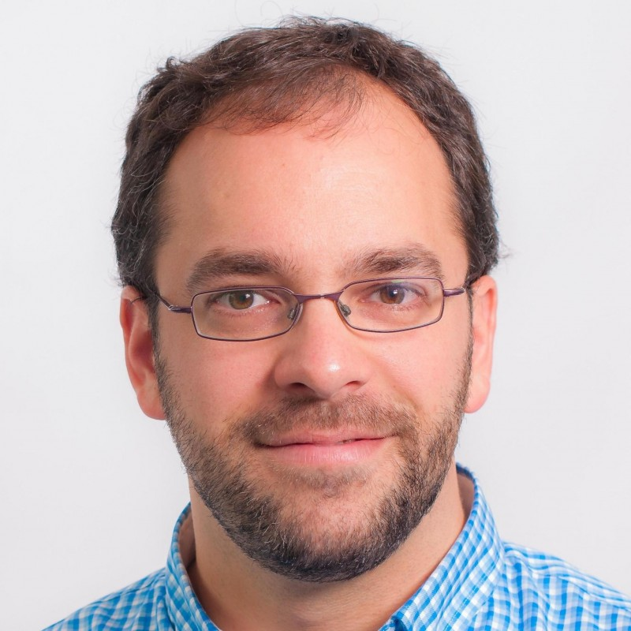

+++
title = "2 December 2019: Mathias Verraes on Temporal Analysis Patterns"
date = "2019-11-14T11:51:44+00:00"
author = "Peter"
aliases = ["/2-december-2019-matthias-verraes-on-temporal-analysis-patterns/"]

[event]
  title = "Temporal Analysis Patterns"
  date = "2019-12-02T20:00:00+01:00"
  speaker = "Matthias Verraes"
  meetup_url = "https://www.meetup.com/Bruges-Software-Development-Meetup-Group/events/266460627"
+++

When we design software for a complex domain, it helps to have a deep understanding of that domain, and reflect it in the system's model. That's the central premise of DDD. Many interesting business domains are temporal; they involve many interconnected processes and behaviours happening over time.

This is where traditional ways of understanding our domains fall short: they look at the artifacts of those processes, but not enough at the processes themselves.

Temporal analysis patterns help us see recurring patterns in how the processes in our domains work and are organised. The insights well get from applying the patterns, show us how to choose objects, components, and services. This leads to better decoupled systems, both internally and at the level of integrations.

This talk starts at 20:00 and lasts 1 hour.

## RSVP

Please notify us of your presence on [meetup.com](https://www.meetup.com/Bruges-Software-Development-Meetup-Group/events/266460627).

## About Matthias Verraes

Mathias Verraes advises organisations on designing and modelling software for complex environments, including architecture, analysis, testing, and refactoring “unmaintainable” systems. He has worked with clients in Government, Logistics, Mobility, Energy, E-Commerce, and more. 

He teaches Domain-Driven Design courses and curates the DDD Europe conference. When he’s at home in Kortrijk, Belgium, he helps his two sons build crazy Lego contraptions. 

[Website](http://verraes.net/)  
[Twitter](https://twitter.com/mathiasverraes)

  
  

##  About the location

The event is in the building of Onafhankelijk Ziekenfonds at Gistelse Steenweg 294, Sint-Andries, Brugge.

Parking is available around the entire building. If you can't find a parking space, just drive a little further around the building.

There will be arrows pointing the way from the entrance all the way up to the room on the 3rd floor. 

Doors open at 19:30, session starts at 20:00 and lasts 1 hour.