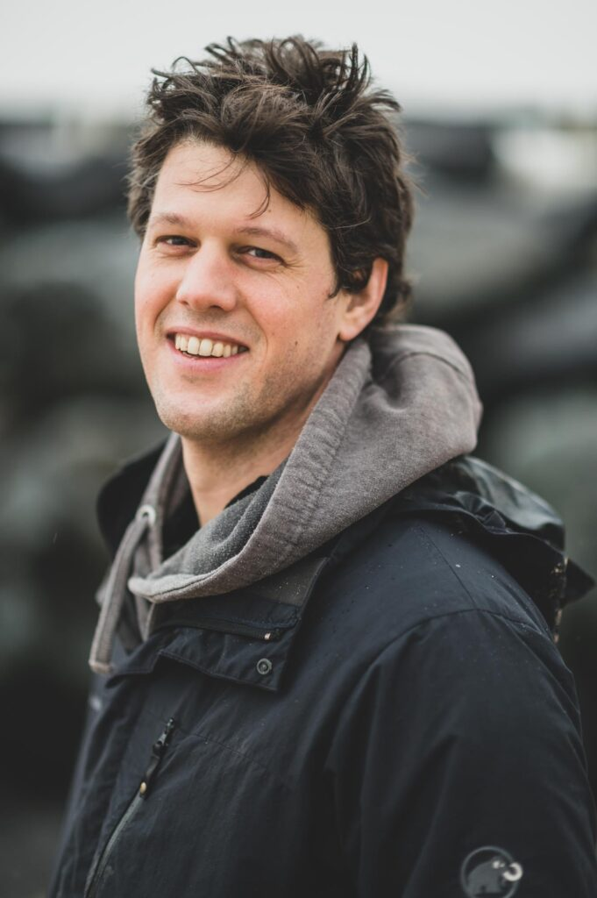

+++
title = "21 April 2021 - Hannes D'Hulster: It's All About People"
date = "2021-03-22T19:21:06+00:00"
author = "Peter"
aliases = ["/21-april-2021-hannes-dhulster-its-all-about-people/"]
+++

A true story about how a 90ies email marketing tool was transformed into a modern product organisation. Product, here, deals with what features should be build and how they should work. Not technically, but from a business but mostly a user point of view.  
We’ll tell you what we changed, how we handled that and how this affects all people involved. It includes change and heavy moments, but it has a happy ending.

## Hannes D'Hulster

Born in Bruges, studied in interaction design in Genk and designed educational games, websites and applications since 2001. With his collective Smooth Sailing he helps start-ups and scale-ups to reduce the chaos in their head, software and team.  
In his hometown, he organises Cityhacks, a yearly hackathon and during his student years he helped building Brugsebuurten. In his spare time he likes to go for a “toerke van de vesten” and is part of the board of Het Entrepot.

## RSVP

Please RSVP on our [Meetup page](https://www.meetup.com/Bruges-Software-Development-Meetup-Group/events/277094402).