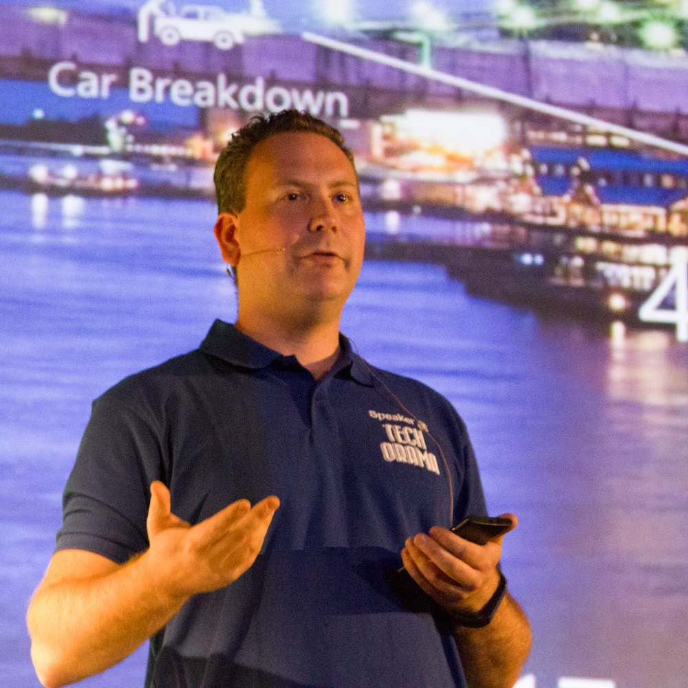

+++
title = "28 Sept 2022: Building Offline Capable Progressive Web Apps - Yves Goeleven"
date = "2022-09-08T06:38:00+00:00"
author = "Peter"
aliases = ["/28-sept-2022-building-offline-capable-progressive-web-apps-yves-goeleven/"]

[event]
  title = "Building Offline Capable Progressive Web Apps"
  date = "2022-09-28T20:00:00+02:00"
  speaker = "Yves Goeleven"
  meetup_url = "https://www.meetup.com/bruges-software-development-meetup-group/events/288347330/"
+++

Past weekend we delivered over 1300 meals at our basketball clubs takeaway fundraiser in under 3 hours. The unsung hero of this effort is an order management system that runs equally well online as well as offline. Building such a system proved to be quite a challenge. In this session I want to share some of the architectural, design and implementation lessons that I've learned along the way while solving this challenge.

## Yves Goeleven

Yves is an independent software architect and founder of clubmanagement.io. He is specialized in the design of distributed software systems using Progressive Web Applications, Event Driven Architecture, Domain Driven Design, Event Sourcing, messaging, and Microsoft Azure.

## RSVP

Please RSVP on our [Meetup page](https://www.meetup.com/bruges-software-development-meetup-group/events/288347330/).

## Slides

Can be found [here](https://www.linkedin.com/feed/update/urn:li:activity:6981526950620110848).