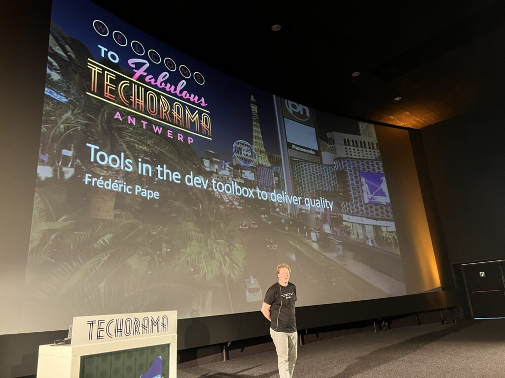

+++
title = "30 Nov 2022: Tools in the dev toolbox to deliver quality"
date = "2022-11-18T12:18:53+00:00"
author = "ar01grd5"
aliases = ["/30-nov-2022-tools-in-the-dev-toolbox-to-deliver-quality/"]

[event]
  title = "Tools in the dev toolbox to deliver quality"
  date = "2022-11-30T20:00:00+01:00"
  speaker = "Frederic Pape"
  meetup_url = "https://www.meetup.com/bruges-software-development-meetup-group/events/289830980/"
+++

Software development is expensive, software has bugs, fixing bugs is expensive. Is there no way to turn things around? Don't we have tools available to deliver software with higher quality? Yes we do!

In this session I'll share my experiences which tools really contribute to deliver quality in software development.

In this presentation I address the following topics from a non-coding point of view.

  * Getting things done
  * CI/CD
  * DevOps culture
  * DDD
  * Eventstroming
  * TDD
  * Pair Programming

What are the benefits of applying them in your daily dev routines!

## Frederic Pape

Senior Software Engineer, Axians Business Applications In the software industry since 2001, working at Axians since 2006. Since the start of my career still a tech boy loving programming languages, tools, frameworks… but my main passion is creating and delivering software. My aim is always to build and deliver the 'right' thing. I'm developer advocate, championing DDD, TDD & pair programming. After working hours I'm a husband, father and addicted tabletop gamer.

## RSVP

Please RSVP on our [Meetup page](https://www.meetup.com/bruges-software-development-meetup-group/events/289830980/).

## Slides

Can be found [here](https://www.linkedin.com/feed/update/urn:li:activity:7004040038627835906).