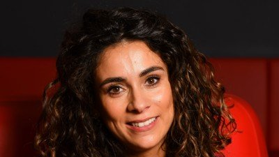

+++
title = "10 May 2023: How to Effectively Spy on Your Systems"
date = "2023-02-28T07:38:10+00:00"
author = "Peter"
aliases = ["/10-may-2023-how-to-effectively-spy-on-your-systems/"]

[event]
  title = "How to Effectively Spy on Your Systems"
  date = "2023-05-10T20:00:00+02:00"
  speaker = "Laïla Bougriâ"
  meetup_url = "https://www.meetup.com/bruges-software-development-meetup-group/events/291655665/"
+++

OpenTelemetry is a rapidly growing standard for distributed tracing, logging, and metrics and is quickly achieving its purpose of becoming an industry-wide embraced standard. The early adoption within the .NET ecosystem, has made it a breeze to use in your applications. But larger, more complex systems, introduce challenges that require us to strengthen our understanding of observability and the capabilities of the OpenTelemetry specification.

However, there are more complex scenarios to consider when investing in the visibility of larger distributed systems. To do so, we need to understand how to choose the right observability signal for the right job, when and how to propagate information, and consider the right criteria when selecting a sampling strategy. In this session, you'll learn the right questions to ask, and gain a deeper understanding of the available options in the observability space to become more effective in spying on your systems!

**This talk starts at 20:00. The talk will be in English.**

## Laïla Bougriâ

Laïla Bougriâ

Laïla Bougriâ is a software engineer at Particular Software, makers of NServiceBus and a Microsoft Azure MVP. She's passionate about software and always looking for patterns, both in code and in yarn. In her free time she loves to knit or crochet and spend time with her kids playing whatever the day brings!

## RSVP

Please RSVP on our [Meetup page](https://www.meetup.com/bruges-software-development-meetup-group/events/291655665/).

Please note that this event will not take place at our usual location, but rather at Zorgi, Legeweg 157, Oostkamp.