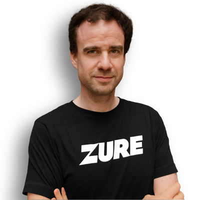

+++
title = "Help! As an Azure developer, I'm afraid of drowning in that big lake of data stuff"
date = "2024-08-26T19:39:14+00:00"
author = "ar01grd5"
aliases = ["/__trashed/"]

[event]
  date = "2024-09-18T20:00:00+02:00"
  speaker = "Ruben Delange"
  meetup_url = "https://www.meetup.com/bruges-software-development-meetup-group/events/303059924"
+++

In today’s data-driven world, Azure developers are increasingly required to collaborate with data engineers, analysts, and scientists to build robust and efficient data solutions. Having no data affinity whatsoever, I wanted to break out of my comfort zone and explore this data thing. However, things got pretty confusing, pretty soon.  
Should I focus on data warehouses, lakes, swamps, or lakehouses? Is ELT a typo? Should I learn Greek first to be able to understand these delta, kappa, and lambda architectures? And what should I do to get a bronze, silver, or gold data medal?  
This session will be packed with information that I wish I had when starting my data journey. You will get practical guidance on how to implement your data solutions using Azure PaaS and Data components.  
By the end of this session, you will be able to engage in meaningful discussions with other data professionals without feeling like an imposter.  
So expand your horizons, boost your knowledge, and let this session be your first step towards a data mesh nirvana!

## Ruben Delange

Ruben is a passionate Azure Architect at Zure. His job is to design and implement reliable, secure and scalable integration and back-end solutions in the Azure cloud. His focus is mainly on architecting and building Azure PaaS fit-for-purpose solutions.

This talk will be given in English.

The location is the Zorgi offices at Legeweg 157, Oostkamp.

## RSVP

Please RSVP on our [Meetup page](https://www.meetup.com/bruges-software-development-meetup-group/events/303059924).