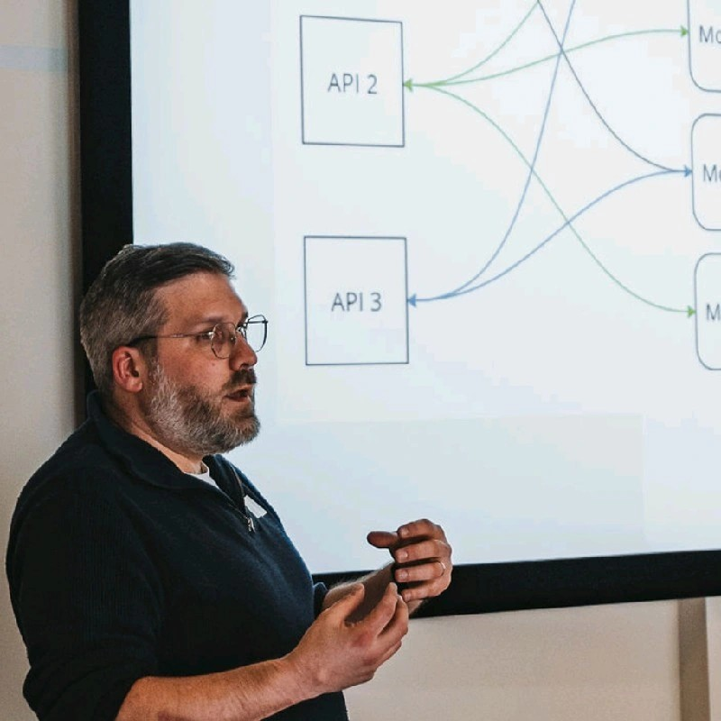

+++
title = "Modular Monolith: de brug tussen monoliet en microservices"
date = "2024-11-17T09:37:12+00:00"
author = "ar01grd5"
aliases = ["/4-december-2024-modular-monolith-de-brug-tussen-monoliet-en-microservices/"]

[event]
  date = "2024-12-04T20:00:00+01:00"
  speaker = "Angelo Dejaeghere"
  meetup_url = "https://www.meetup.com/bruges-software-development-meetup-group/events/304579698/"
+++

In deze presentatie deel ik mijn inzichten over de 'modular monolith' architectuur en hoe deze een flexibele en schaalbare basis biedt voor moderne applicaties. Ik bespreek hoe je nieuwe applicaties kunt bouwen met deze architectuur, hoe je bestaande systemen kunt omvormen, en ik vergelijk de voor- en nadelen met microservices. Aan de hand van een real-world voorbeeld laat ik zien hoe ik de modular monolith heb toegepast in een project om zowel de ontwikkelsnelheid als de schaalbaarheid te verbeteren, zonder de complexiteit van volledige microservices.

## Angelo Dejaeghere

Hi there!

I’m angelo, a proud dad of two amazing kids and a lucky husband to a wonderful partner.

I love creating awesome software that solves real problems. I’m super into things like software architecture, DevOps, and cloud technologies.

My goal? Working with people to create software that’s not only scalable and reliable, but also easy to maintain.

When I’m not coding, I enjoy the magic of 3D printing.

This talk will be given in Dutch.

The location is the Bits of Love offices at Koning Albert I-laan 96a, Brugge.

## Parking

There are a few parking spaces available in the inner court yard of the building complex:

Then there are more spaces in front of the town hall of Sint-Michiels and in the Rijselstraat:

## RSVP

Please RSVP on our [Meetup page](https://www.meetup.com/bruges-software-development-meetup-group/events/304579698/).