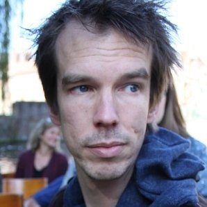

+++
title = "Software is a meal best served with different architectural spices"
date = "2025-09-03T00:00:00+00:00"
author = "Peter"
aliases = ["/3-december-2025-refactoring-workshop/"]

[event]
  date = "2025-12-03T20:00:00+01:00"
  speaker = "Jan Bols"
  meetup_url = "https://www.meetup.com/bruges-software-development-meetup-group/events/308256847/"
+++

Every programmer deals with software architecture. Every day. All the time. Some knowingly, some unaware. Not one single architecture, but a mixture of different ones, different styles, different patterns. Like ingredients in a meal.

In this talk we take you to a journey departing from the gang-of-4-train-station, passing through interesting places like hexagonal-city, REST-ville, the kingdom-of-events, the metropolis-of-commands-and-queries and of course... the holy-land-of-microservices. At each place we eat the local dishes, we taste the spices, look at what makes each place unique but also how they are similar.

When we finally return home, we make a nice soup. Or a stew if you like. It tastes good because we have learned to cook with different ingredients. Different styles.

In this talk you will learn what different architectural styles have in common and how they differ. What you gain when applying them, but also what you have to give in return.

At the end it focuses on how your value-system drives the way your code looks like. Programming is not about being right, but about expressing the values you prefer over others.

This meetup starts at 20:00.

This meetup will happen in the offices of [Bits of Love](https://www.bitsoflove.be/). 
The parking space is limited, so it's advised to come on time (or by bike). You can also park your car in the [parking space at the roundabout](https://maps.app.goo.gl/bnNoe1ZnGJq47Qru7), 
or [the parking strip in the Rijselstraat](https://maps.app.goo.gl/tKpf7aTJmUaZ8GP68).

## About Jan Bols

I started programming in 2001. A developer's odyssey. Being a self-taught I always felt uncertain about stuff I knew and especially stuff didn't know.

In the long run, this uncertainty helped me in finding out how to improve but also finding out why we do the things we do and spotting cargo-cult. This has been a tiring process and the end is not satisfying at all. But software is not about writing the perfect code. It's about building stuff that works.

During the last 20 years, I worked for a software company (Axians) in Belgium either developing custom applications or consulting.